# OpenCore

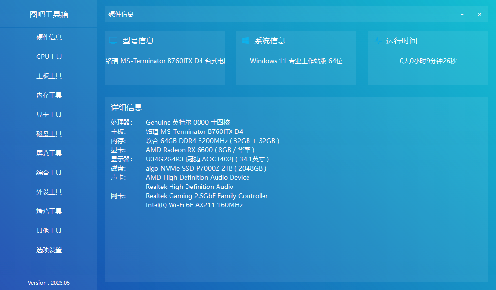

## 简介

完美 😀。

|       Key        |              Value              |
| :--------------: | :-----------------------------: |
| OpenCore version |              0.9.3              |
|  MacOS version   | Ventura 13.4.1 (c) (22F770820d) |

## Bios 设置

- 「高级」-「CPU 配置」-「Intel Hyper Threading Technology」-「开启」
- 「高级」-「CPU 配置」-「CFG Lock」-「关闭」
- 「高级」-「CPU 配置」-「Software Guard Extensions（SGX）」-「关闭」
- 「高级」-「芯片组配置」-「Above 4G Decoding」-「启用」
- 「高级」-「芯片组配置」-「VT-d」-「禁用」
- 「高级」-「芯片组配置」-「共享内存」-「64MB」
- 「高级」-「芯片组配置」-「IGPUA 多监视器」-「启用」
- 「高级」-「芯片组配置」-「深度睡眠」-「在 S4-S5 中启用」
- 「高级」-「存储 配置」-「SATA 模式选择」-「AHCI」
- 「高级」-「Intel(R) Thunderbolt」-「Discrete Thunderbolt(TM) Support」-「关闭」
- 「高级」-「ACPI 配置」-「挂起到内存」-「自动」
- 「高级」-「ACPI 配置」-「USB 键盘/远程开机」-「Disabled」
- 「高级」-「ACPI 配置」-「USB 鼠标开机」-「Disabled」
- 「高级」-「USB 配置」-「XHCI Hand-off」-「Enabled」
- 「安全」-「Secure Boot」-「安全引导」-「关闭」
- 「安全」-「Intel(R) Platform Trust Technology」-「禁用」
- 「引导」-「闪速启动」-「关闭」
- 「引导」-「CSM」-「关闭」

## 安装说明

- 

## 硬件

|   Key    |                            Value                             | Other |
| :------: | :----------------------------------------------------------: | ----- |
|   CPU    |                  Genuine 英特尔 0000 十四核                  | q0wh  |
|   显卡   |                AMD Radeon RX 6600( 8GB /华擎)                |       |
|   内存   |            玖合 64GB DDR4 3200MHz ( 32GB + 32GB )            |       |
| 无线网卡 |                Intel(R) Wi-Fi 6E AX211 160MHz                |       |
| 有线网卡 |           Realtek Gaming 2.5GbE Family Controller            |       |
|   声卡   | AMD High Definition Audio Device Realtek High Definition Audio |       |
|   硬盘   |                   aigo NVMe SSD P7000Z 2TB                   |       |
|   接口   |                              ~                               |       |

## 正常工作

## 存在的问题

- 核显无法驱动

## 部分系统截图

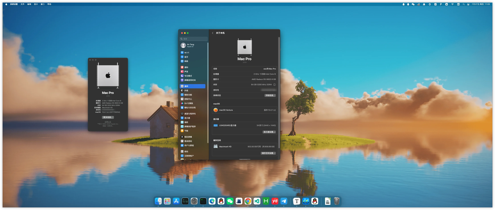

程序坞

| Describe | screenshot                                                   |
| -------- | ------------------------------------------------------------ |
| USB      | 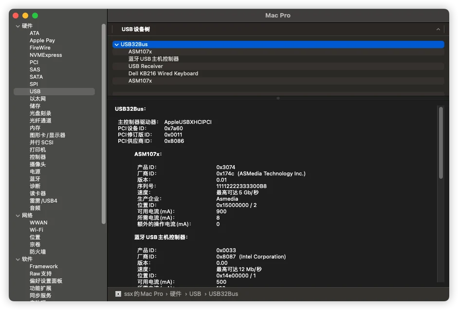 |
| 以太网   | 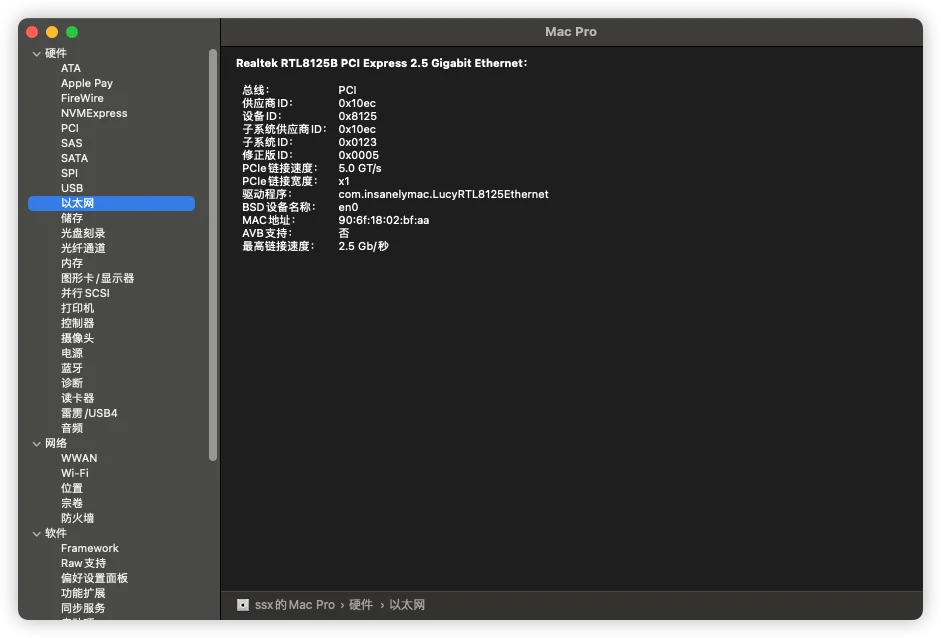 |
| 内存     | 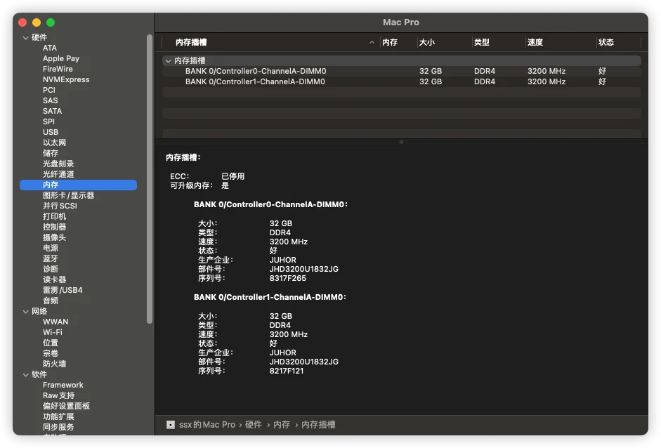 |
| 显卡     | 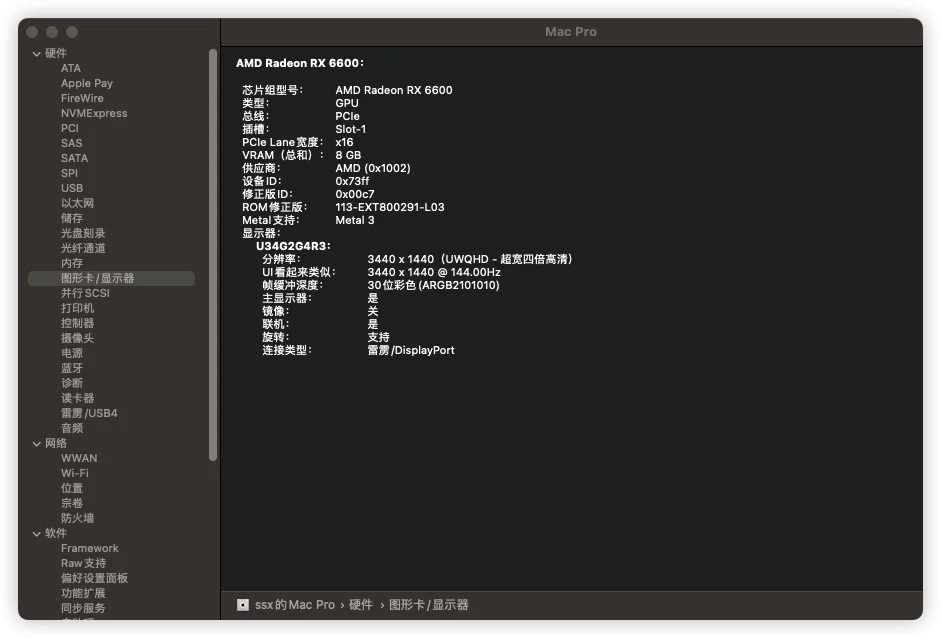 |
| 电源     | 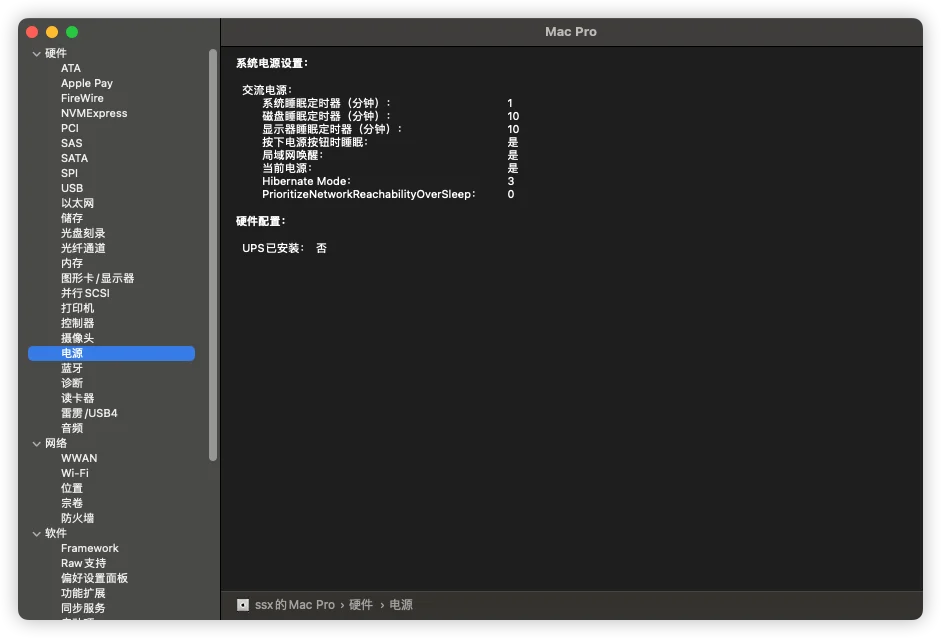 |
| 蓝牙     | 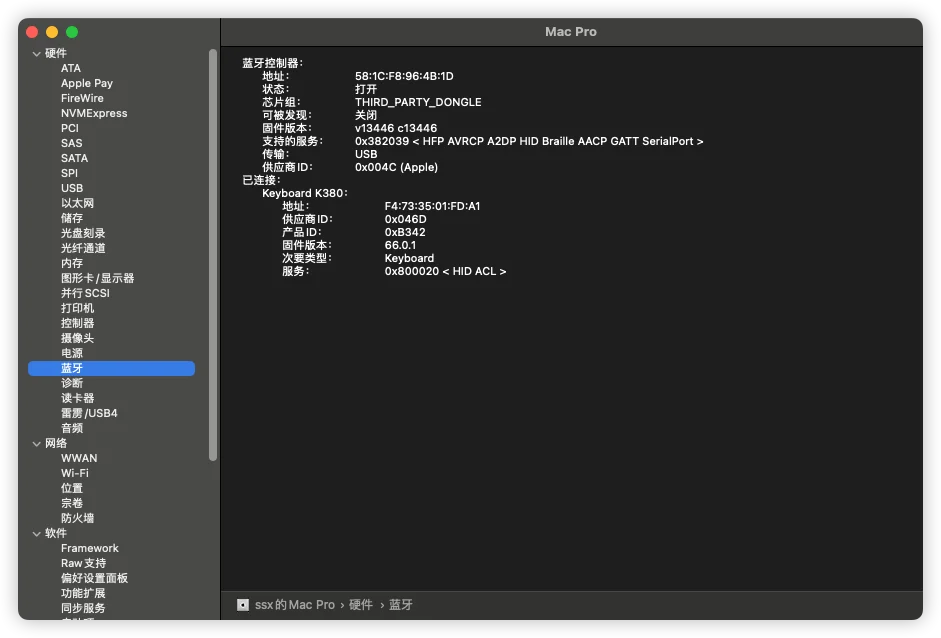 |
| WIFI     | 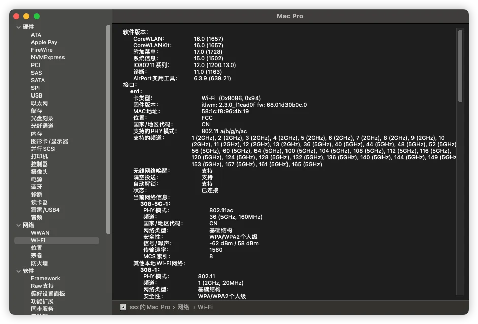 |

## 部分 efi 截图

| Describe | screenshot                                                   |
| :------: | ------------------------------------------------------------ |
|   ACPI   | 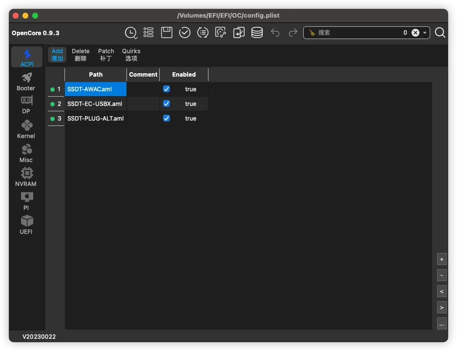 |
|  Kernel  | 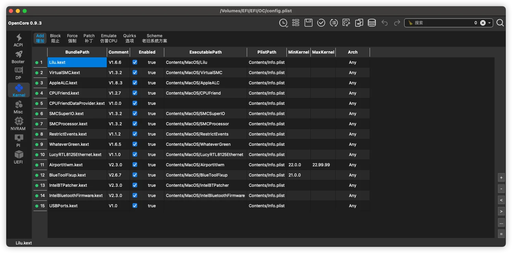 |

## 更新日志

### 2023-07-26

- 第一次上传

## 参考

- [国光 2023 年中全能生产力黑苹果装机方案）](https://apple.sqlsec.com/9-%E6%88%90%E6%9E%9C%E5%88%86%E4%BA%AB/9-2/) by 国光
